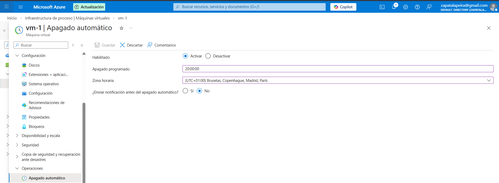

# Lab 32 - Auto-shutdown para ahorrar coste en una VM

En este lab he configurado el autoapagado de una máquina virtual de Azure para evitar que se quede encendida cuando no hace falta.

Es una configuración simple, pero viene bien para enseñar una idea importante: no solo se trata de desplegar recursos, también hay que vigilar el coste. En un laboratorio o en un entorno de pruebas, una VM encendida todo el día puede generar gasto innecesario.

## Lo que he hecho

He ido a la configuración de la VM, he activado la opción de autoapagado y he dejado una hora programada para que la máquina se apague sola cada día.

## Evidencia

### Configuración final del autoapagado

## Archivo de la captura

`images/01-auto-shutdown-config.png`

## Cómo lo explicaría en entrevista

“Es una acción sencilla de control de costes. Para una VM de laboratorio o de pruebas, programar el autoapagado evita gasto innecesario cuando ya no se está usando. No sustituye a una estrategia completa de FinOps, pero sí es una medida rápida y útil.”
